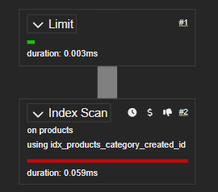
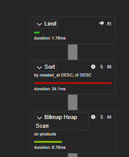

## Pagination Strategy

The API uses cursor (keyset) pagination based on
(created_at, id).

Example:

SELECT *
FROM products
WHERE category = $1
AND (created_at, id) < ($2, $3)
ORDER BY created_at DESC, id DESC
LIMIT 20;

This avoids the performance and consistency issues of OFFSET pagination.

### SEE THE DIFFERENCE IN PERFORMANCE BETWEEN OFFSET AND CURSOR PAGINATION

### Performance Comparison

OFFSET Pagination

Execution Time: ~33.5 ms

Cursor Pagination

Execution Time: ~0.08 ms

Cursor pagination allows PostgreSQL to seek directly into the composite index instead of scanning and sorting tens of thousands of rows.

